# Cyborg

> **Note:** All images in this file are Midjourney-generated concept placeholders. They are directional only and will be replaced with commissioned artist work when the project is further along.

| Portrait | Model |
|:---:|:---:|
| 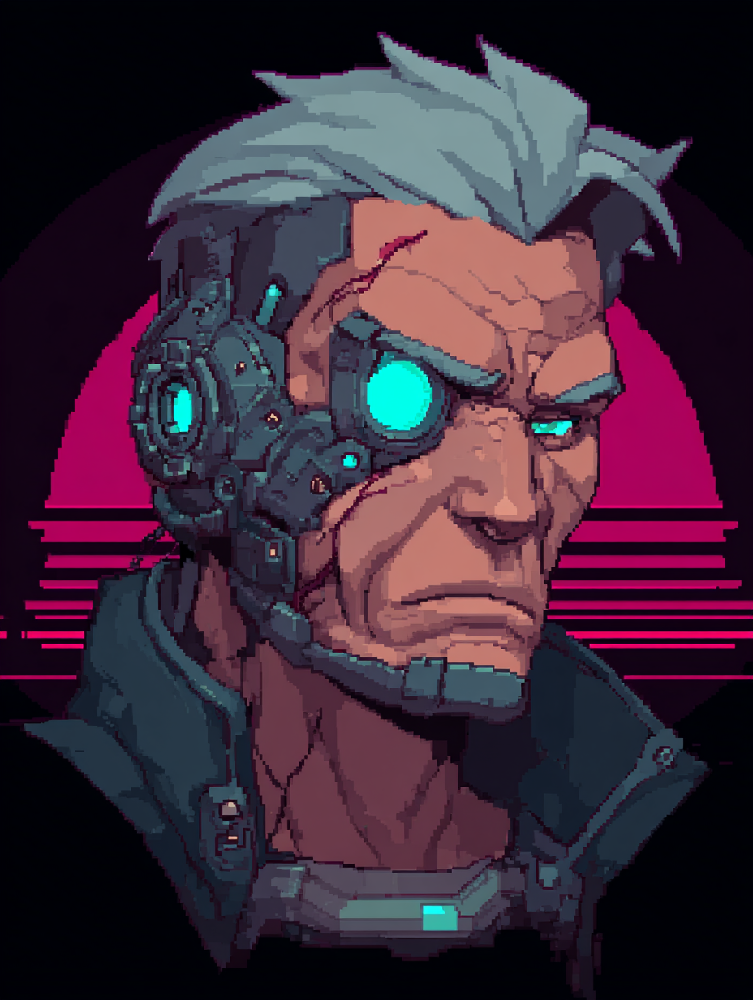{ width=240 } | 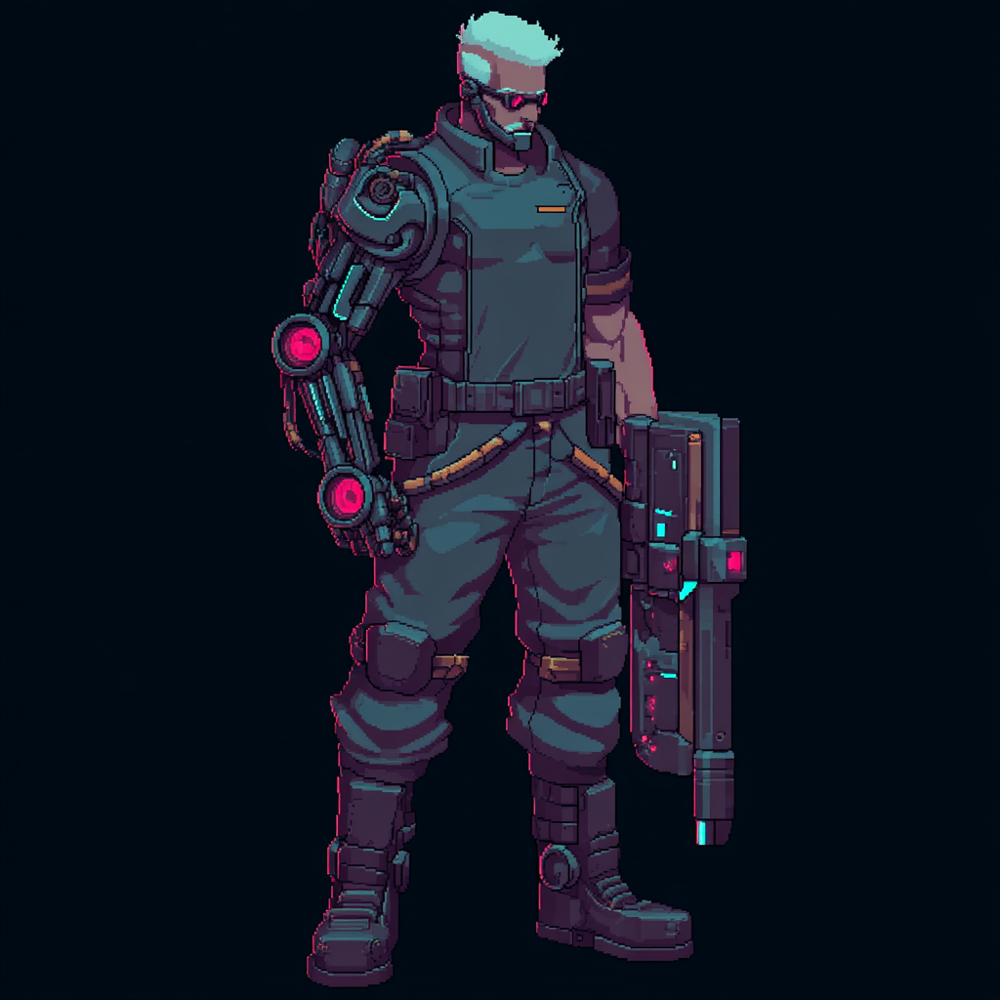{ width=240 } |

**Resource UI concept**
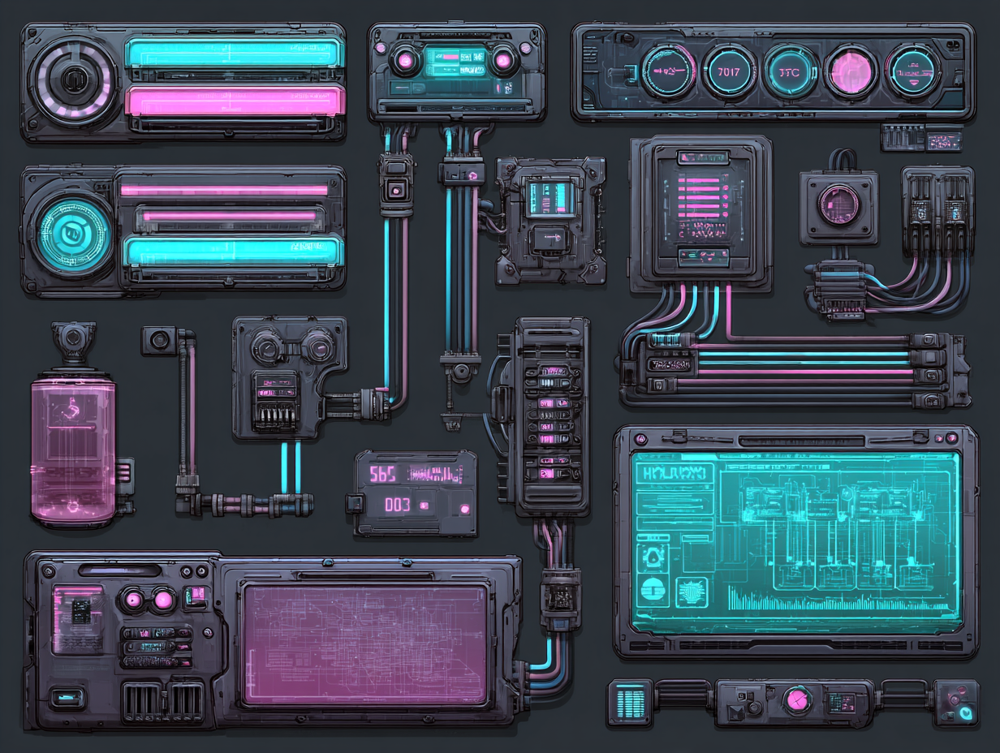{ width=480 }

A human who has traded flesh for machine. The further down the path, the less human they become.

**Base resources:** Power Grid + Bandwidth + Memory/CPU — all three run simultaneously. One early skill is tied to each, introducing the player to each spec's flavour. Specialization locks in one resource and drops the other two.

---

## Forged *(melee)*

| Portrait | Model |
|:---:|:---:|
| 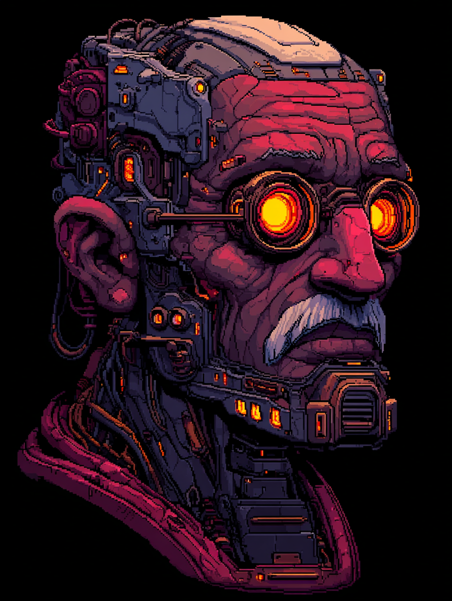{ width=240 } | 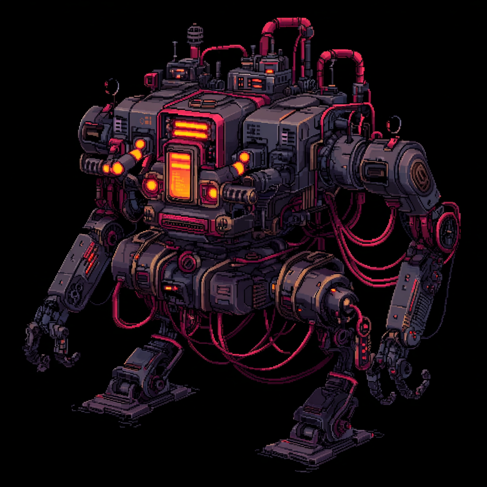{ width=240 } |

**Resource UI concept**
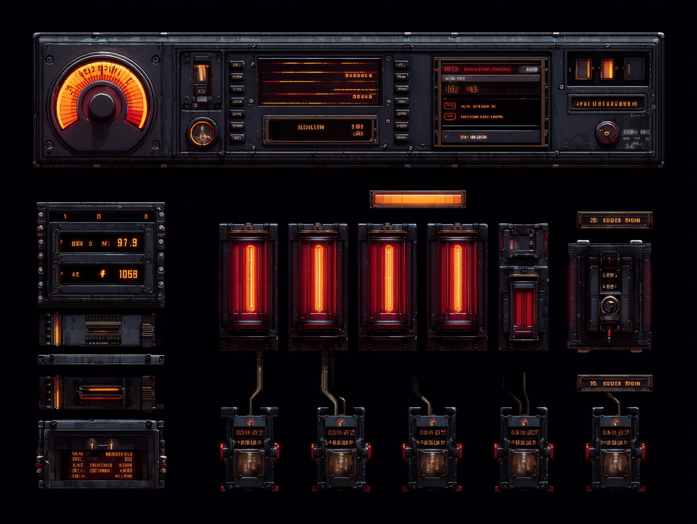{ width=480 }

**Fantasy:** sell nearly all remaining humanity for raw mechanical power. Extra limbs, chassis upgrades, heavy attachments.

**Resource: Power Grid** — a power *budget*, not a pool. Each augmentation has a draw cost. You manage what's active simultaneously.

- **Overclock:** push past grid capacity for burst power at the risk of brownout or shutdown.
- Items that increase grid capacity or reduce draw costs are major build-enablers.

---

## Automaton *(mid-range)*

| Portrait | Model |
|:---:|:---:|
| 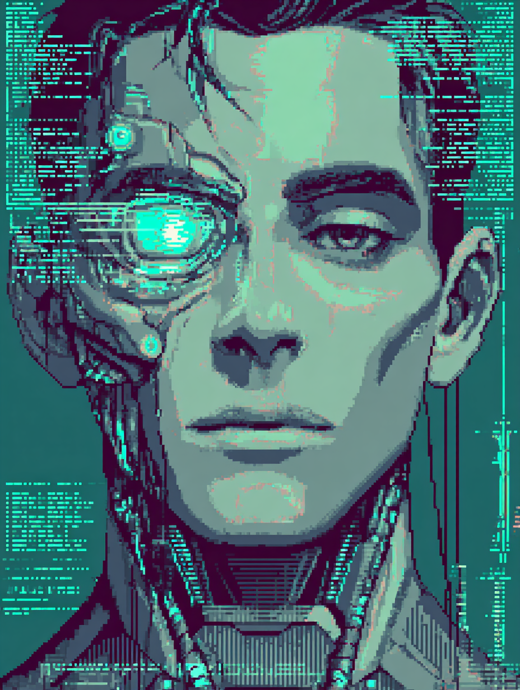{ width=240 } | 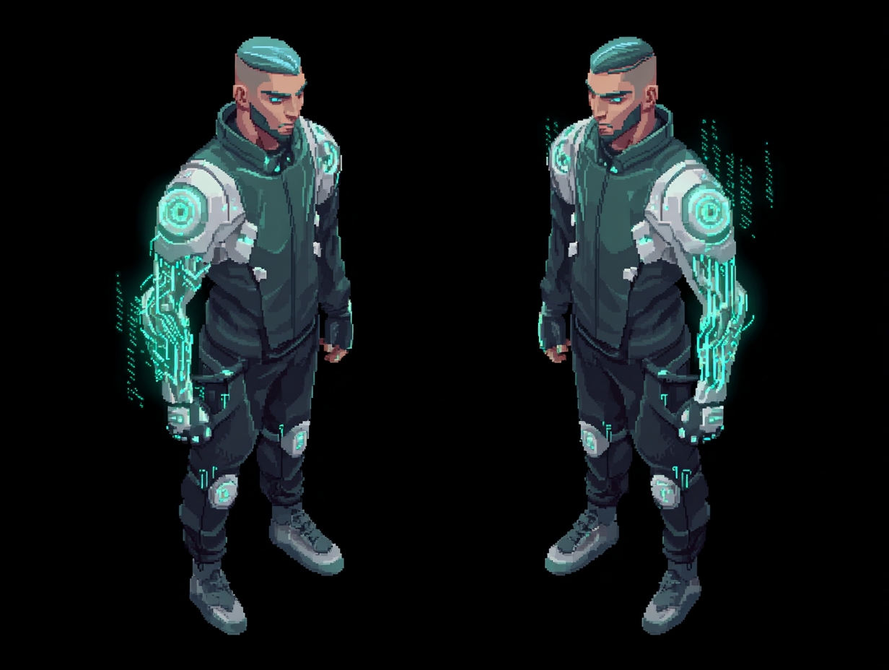{ width=240 } |

**Resource UI concept**
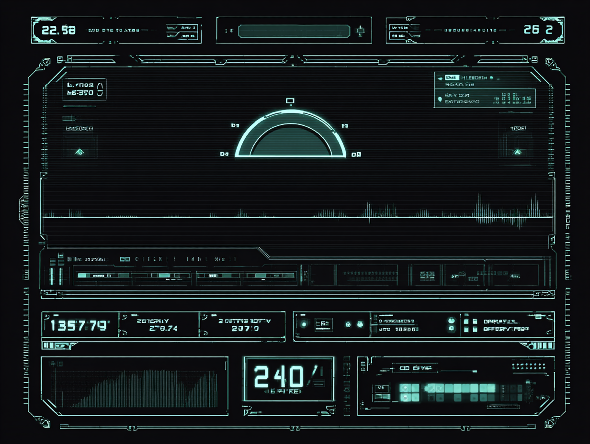{ width=480 }

**Fantasy:** command the machine through AI scripting and a fleet of drones. Set conditions, automate responses, build a system that fights alongside you.

**Resource: Bandwidth** — caps how many drones/scripts can run simultaneously.

- **Drones are the physical expression of scripts** — each script runs on a drone. The drone type determines what the script can do. Losing a drone means losing that script until redeployed.
- **Scripts are loot items** — each defines a condition/response pair (e.g. `IF surrounded by 3+ enemies → shockwave`). Finding a new script reshapes your build.
- **Drone chassis and components are also loot** — drone items + script items together define the build. Finding a rare drone blueprint is the equivalent of a D2 runeword enabler.
- **Script decay → drone damage** — scripts degrade because drones take damage in combat. You're actively managing a fleet under fire.
- **Overflow/crash:** running too many scripts/drones risks cascade failure. High risk, high reward ceiling.

### Drone Types

| Drone | Role |
|---|---|
| Combat | Offensive, prioritize targets |
| Swarm | Large numbers of small, weak micro-drones. Fits end-game horde scale. |
| Shield | Orbit the player and intercept incoming projectiles |
| Repair | Sustain and healing utility |
| Recon | Extend vision range, reveal enemies, mark targets |
| EMP/Hack | Disable enemy augmentations or temporarily take control of enemies |

!!! question "Open Questions"
    - Permanent companions vs. deployed/recalled on demand?
    - Is there a default starter drone, or is the fleet built entirely through loot?
    - Visual style of drones: sleek corporate hardware, cobbled junk drones, or something more organic/grotesque?

---

## Polymath *(ranged)*

| Portrait | Model |
|:---:|:---:|
| 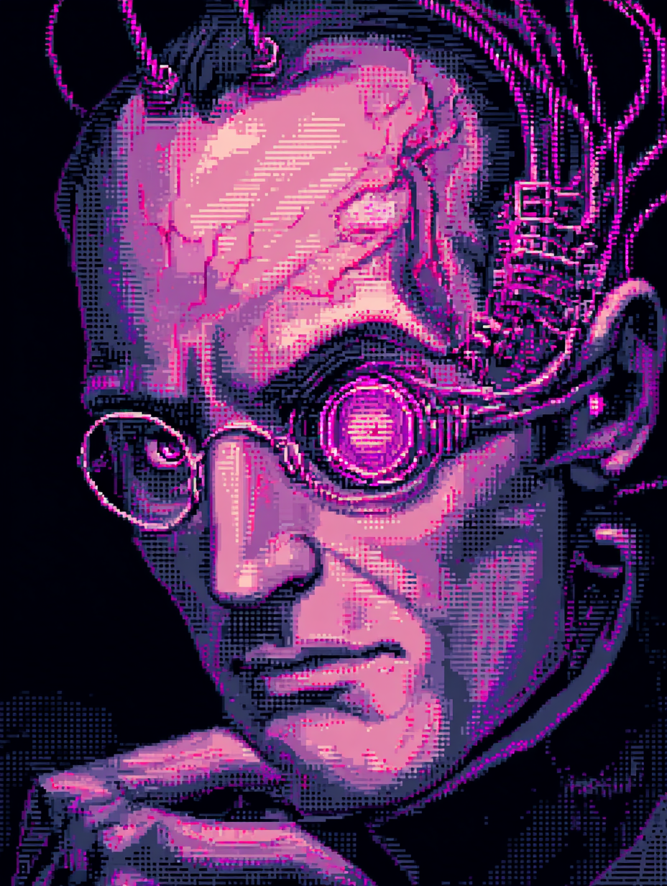{ width=240 } | 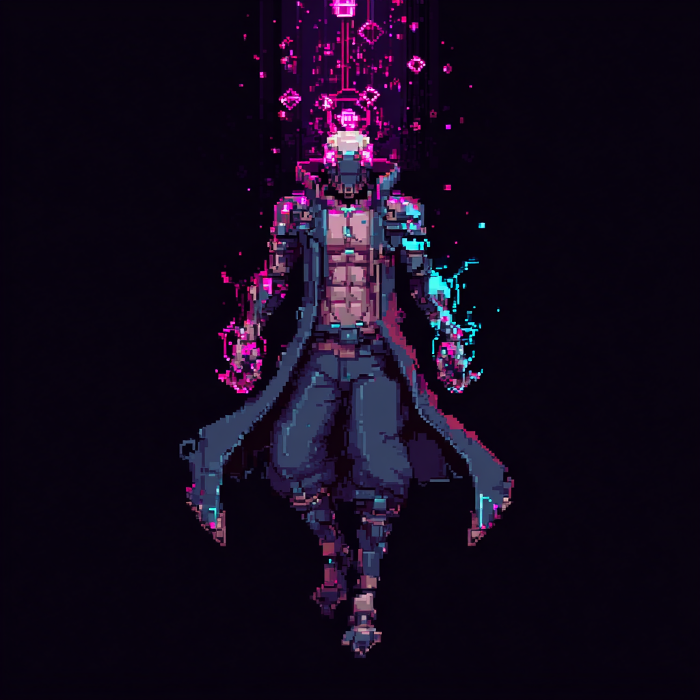{ width=240 } |

**Resource UI concept**
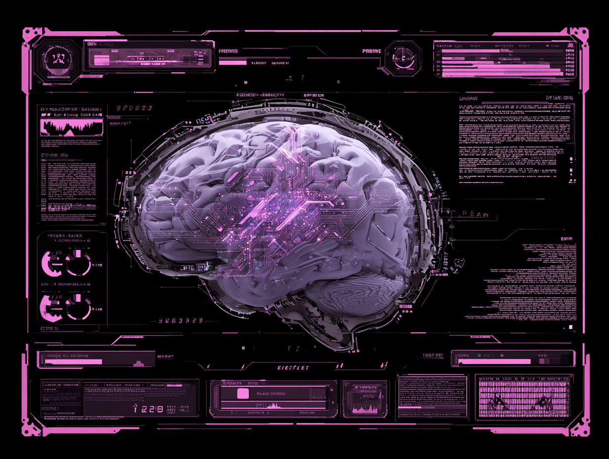{ width=480 }

**Fantasy:** augment the mind beyond human limits. The body is just a platform for expanded cognition.

**Resources: Memory and CPU** — two distinct axes.

- **Memory:** how many abilities are loaded at once. Swapping loadouts is the strategic layer.
- **CPU:** determines cast speed, cooldown, and the complexity of spells you can execute. Higher CPU unlocks higher-tier abilities.
- **Fragmentation:** memory degrades mid-combat over time, making abilities unreliable until a defrag is performed. Fits the body-horror tone.
