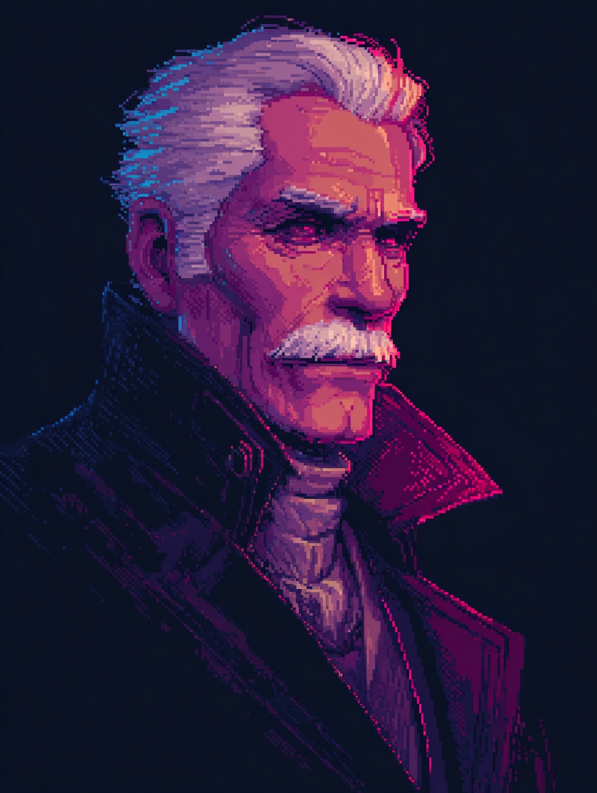
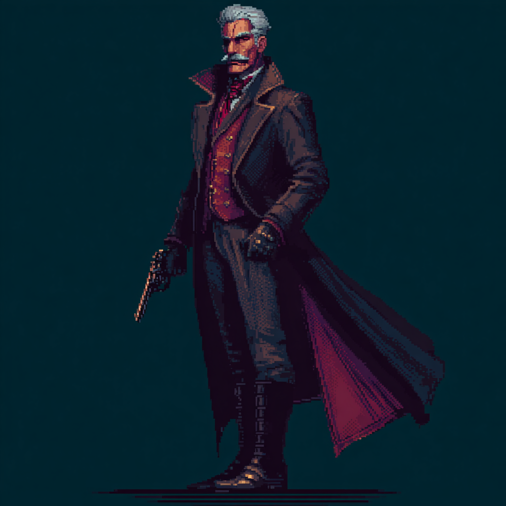
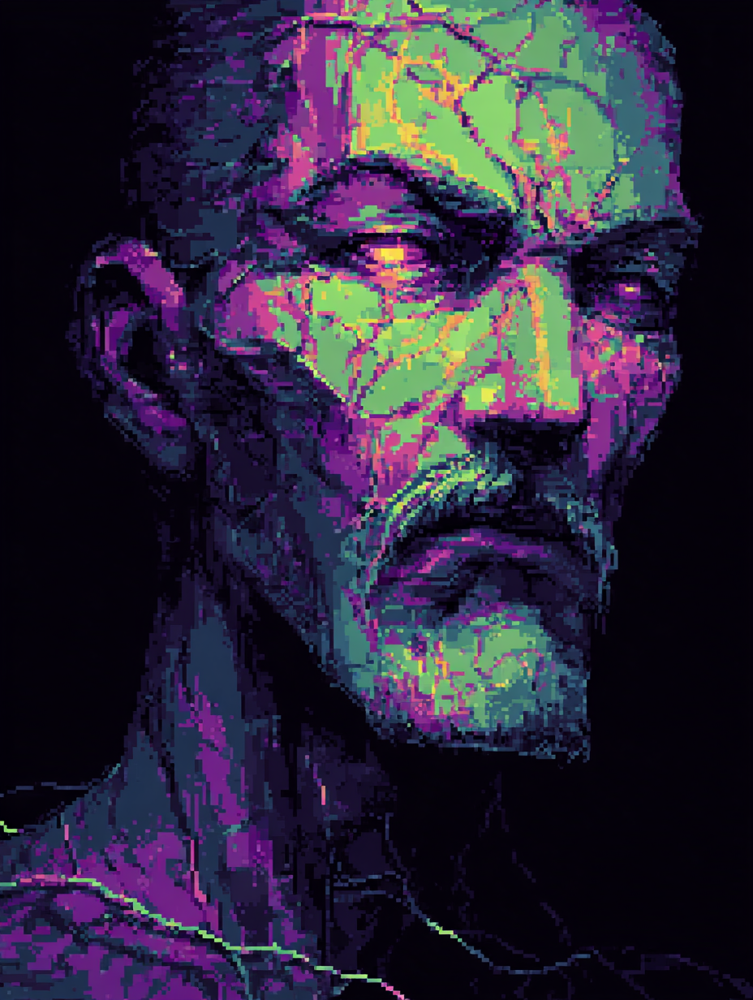
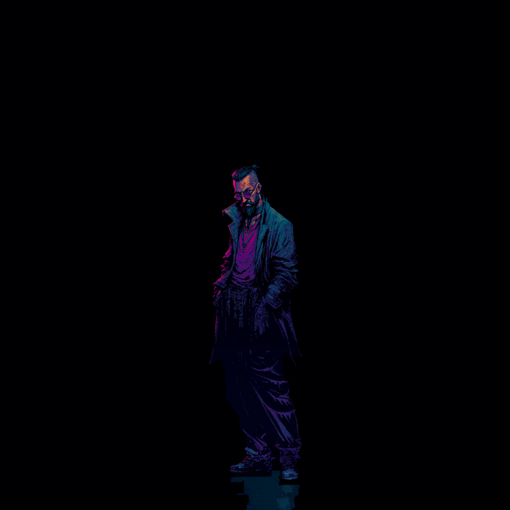

# Human

| Portrait | Model |
|:---:|:---:|
| { width=240 } | { width=240 } |

Unaugmented. In a world that sells upgrades on every corner, the Human refused — or never had the choice. Their power comes from what the Cyborg cut away.

**Base resources:** Adrenaline + Composure + Sanity — all three run simultaneously. One early skill tied to each. Specialization locks in one and drops the other two.

---

## Survivalist

| Portrait | Model |
|:---:|:---:|
| { width=240 } | { width=240 } |

**Fantasy:** adaptability and improvisation. Thrives in chaos, uses scavenged gear and jury-rigged weapons. Gets stronger as conditions get worse.

**Resource: Adrenaline** — builds under pressure, decays when safe. Rewards aggressive, risky play.

---

## Gentleman / Lady *(title reflects character gender)*

| Portrait | Model |
|:---:|:---:|
| { width=240 } | { width=240 } |

**Fantasy:** discipline, composure, old-world refinement. Refused augmentation on principle and became dangerous through mastery instead. Precise, methodical — dueling, marksmanship, controlled aggression.

**Resource: Composure** — maintained through deliberate, controlled play. Breaks under panic, chaos, or sustained damage. High skill ceiling for staying calm under fire.

!!! note "Lady variant"
    Reference art for the female version of this spec is not yet created.

---

## Enculted

| Portrait | Model |
|:---:|:---:|
| { width=240 } | { width=240 } |

**Fantasy:** tapped into something ancient living in the network. The augmentations that make the Cyborg powerful are blocking signals the unmodified mind can receive. Unstable, dangerous power with a horror edge.

**Resource: Sanity** — depletes as occult abilities are used. Push too far and the character becomes dangerous to everything, including themselves.
