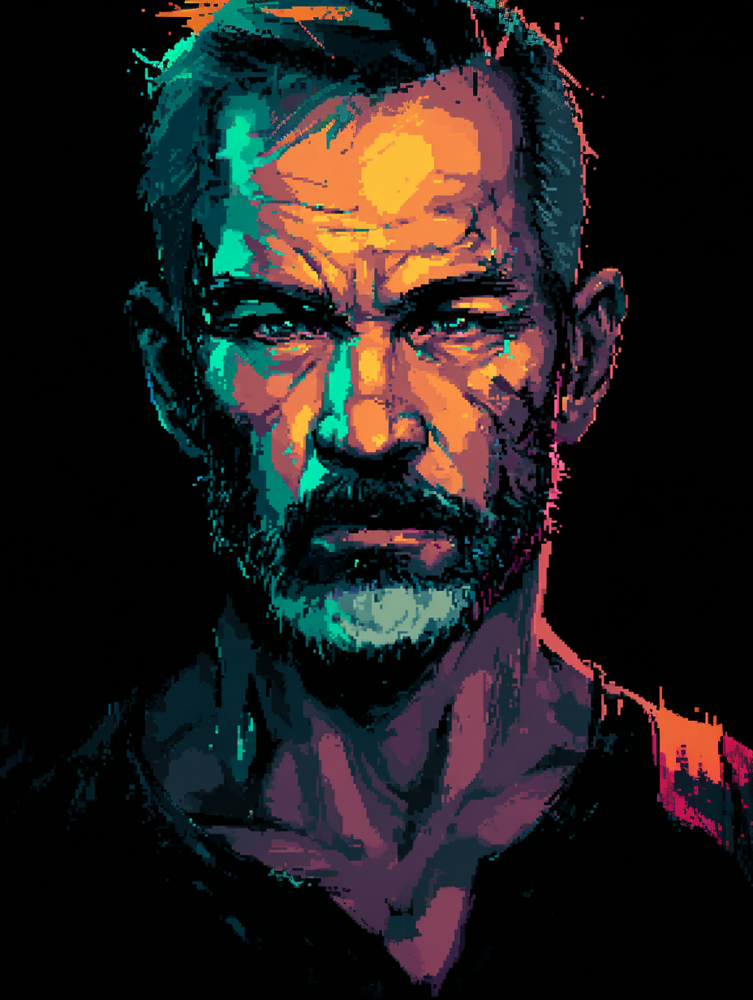
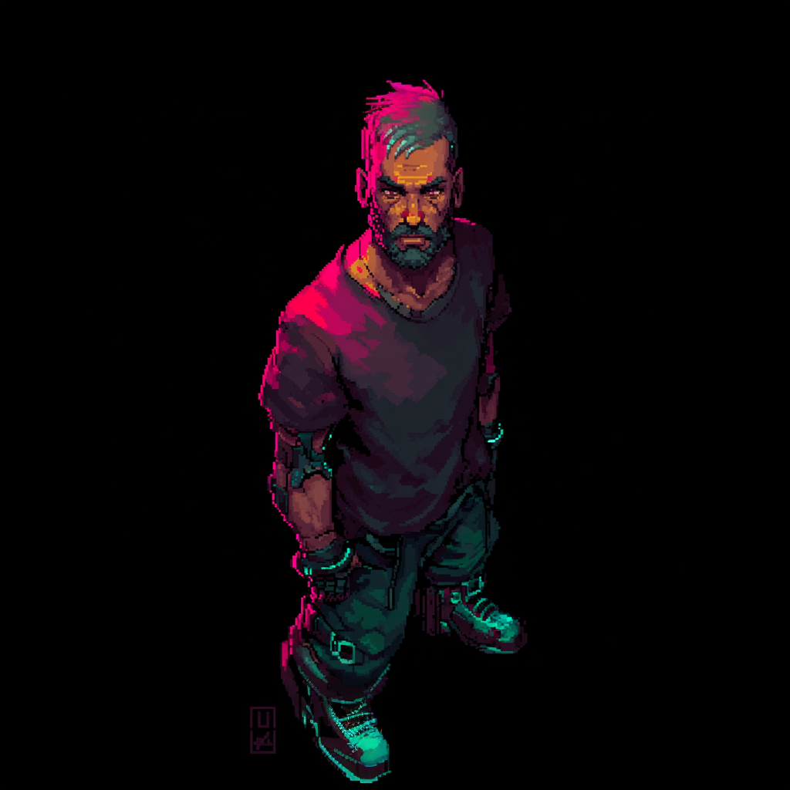
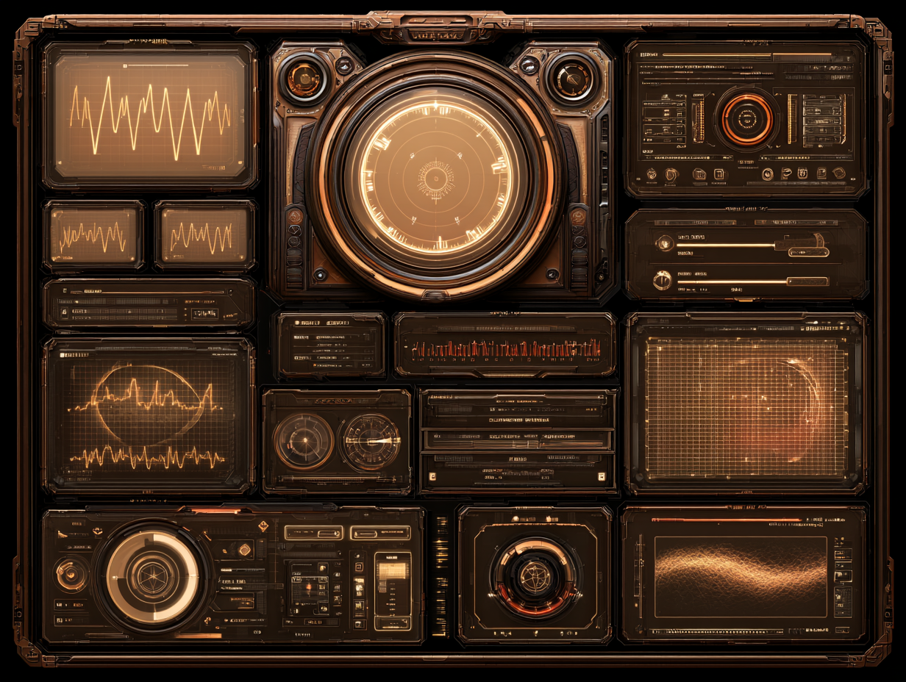

# Human

> **Note:** All images in this file are Midjourney-generated concept placeholders. They are directional only and will be replaced with commissioned artist work when the project is further along.

| Portrait | Model |
|:---:|:---:|
| { width=240 } | { width=240 } |

**Resource UI concept**
{ width=480 }

Unaugmented. In a world that sells upgrades on every corner, the Human refused — or never had the choice. Their power comes from what the Cyborg cut away.

**Attribute:** Soul (derived from Orthodoxy + Ingenuity + Corruption average). See [Attribute System](../design/attribute-system.md).

**Resource:** TBD — one resource that captures the generalist human experience.

## Specialized Classes

- [Survivalist](human/survivalist.md)
- [Gentleman / Lady](human/gentleman.md)
- [Enculted](human/enculted.md)
