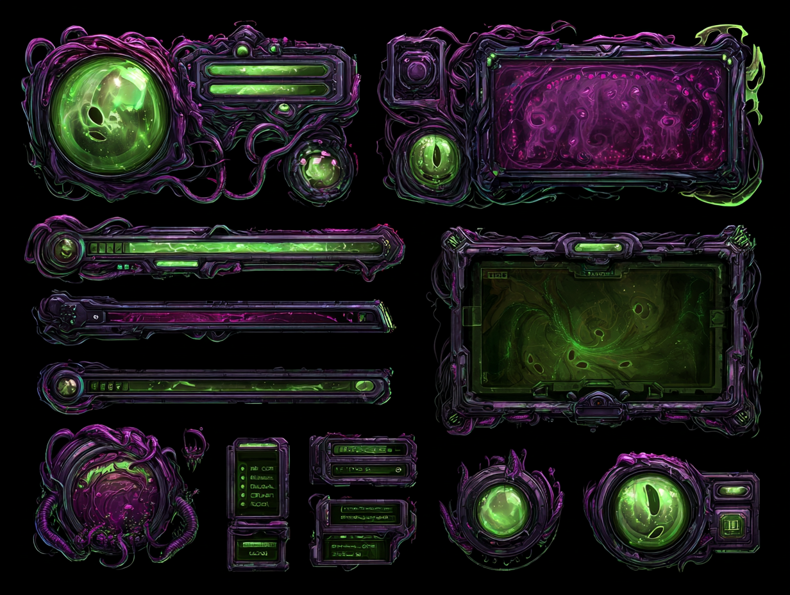

# Enculted

> **Note:** All images in this file are Midjourney-generated concept placeholders. They are directional only and will be replaced with commissioned artist work when the project is further along.

| Portrait | Model |
|:---:|:---:|
| { width=240 } | { width=240 } |

**Resource UI concept**
{ width=480 }

**Fantasy:** tapped into something ancient living in the network. The augmentations that make the Cyborg powerful are blocking signals the unmodified mind can receive. Unstable, dangerous power with a horror edge.

**Resource: Sanity** — depletes as occult abilities are used. Push too far and the character becomes dangerous to everything, including themselves.
