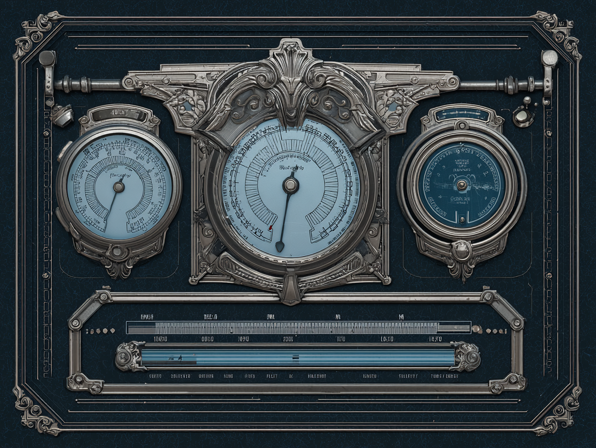

# Gentleman / Lady *(title reflects character gender)*

> **Note:** All images in this file are Midjourney-generated concept placeholders. They are directional only and will be replaced with commissioned artist work when the project is further along.

| Portrait | Model |
|:---:|:---:|
| { width=240 } | { width=240 } |

**Resource UI concept**
{ width=480 }

**Fantasy:** discipline, composure, old-world refinement. Refused augmentation on principle and became dangerous through mastery instead. Precise, methodical — dueling, marksmanship, controlled aggression.

**Attribute:** Orthodoxy — discipline, principle, and refusal to compromise. Opposes Deviation. See [Attribute System](../../design/attribute-system.md).

**Tier perks:** TBD. See [Stat Identity](../../design/attribute-system.md#stat-identity--tier-perks--visual-metamorphosis).

**Resource: Composure** — maintained through deliberate, controlled play. Breaks under panic, chaos, or sustained damage. High skill ceiling for staying calm under fire.

!!! note "Lady variant"
    Reference art for the female version of this class is not yet created.
