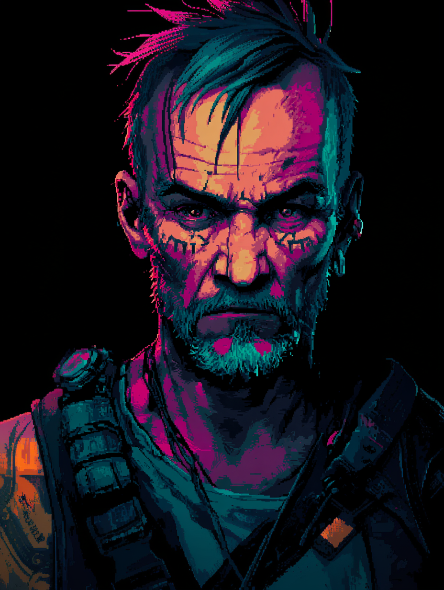
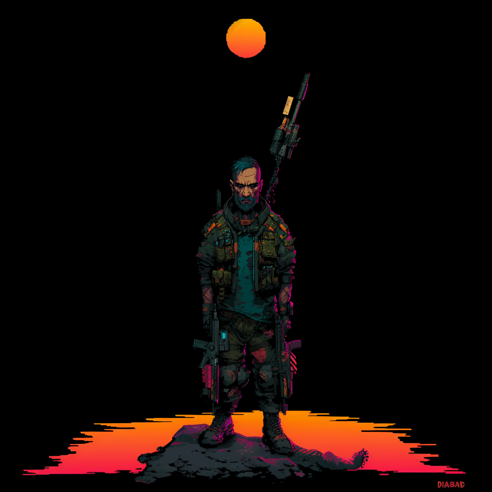
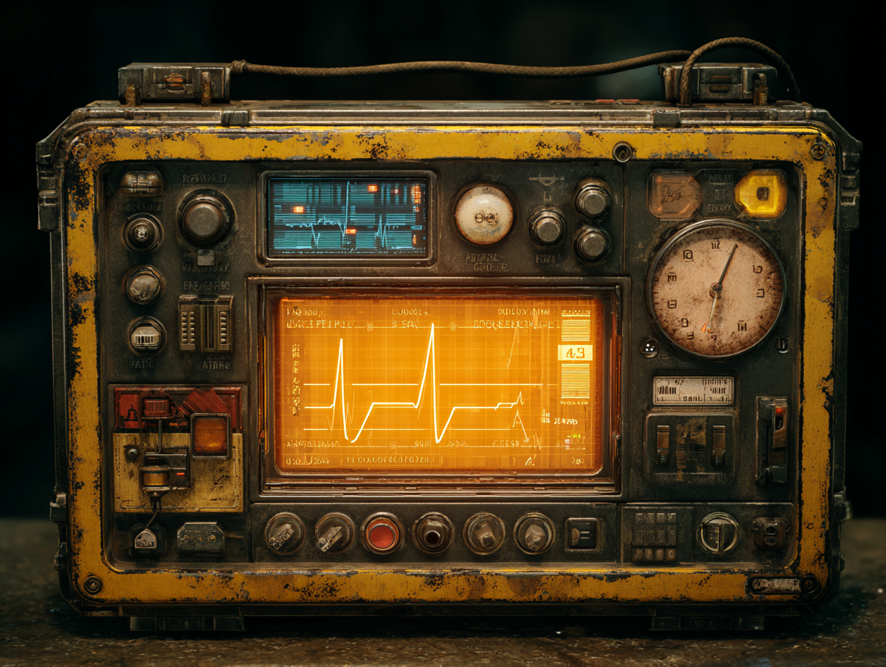

# Survivalist

> **Note:** All images in this file are Midjourney-generated concept placeholders. They are directional only and will be replaced with commissioned artist work when the project is further along.

| Portrait | Model |
|:---:|:---:|
| { width=240 } | { width=240 } |

**Resource UI concept**
{ width=480 }

**Fantasy:** adaptability and improvisation. Thrives in chaos, uses scavenged gear and jury-rigged weapons. Gets stronger as conditions get worse.

**Resource: Adrenaline** — builds under pressure, decays when safe. Rewards aggressive, risky play.
