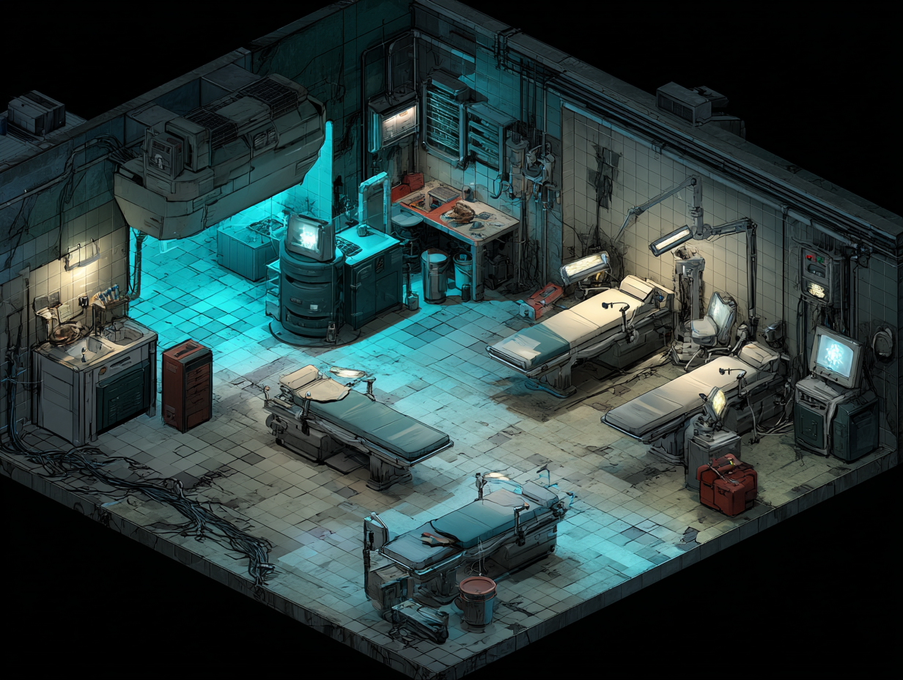
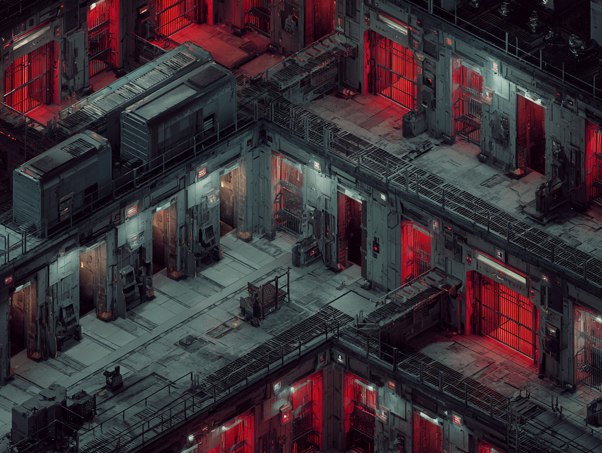

# Starting Zones

## Design Philosophy

Each class begins in a different wing of the same enormous facility. The starting zone is 3 levels long — one per spec — and ends in a boss battle that forces a permanent, meaningful choice. The goal is to make specialization feel like a commitment the player earns, not a menu they click through.

---

## Earth Facility #723

Both starting zones take place inside **Earth Facility #723** — a vast corporate complex that served simultaneously as a cutting-edge augmentation research center and a high-security detention facility. The same corporation that pioneered augmentation technology also imprisoned those who resisted it.

The facility has been abandoned. Not destroyed, not decommissioned with care — simply left. A memo recovered from a terminal near the entrance:

> *"Re: EF-723 Operations Suspension*
> *Facility #723 has been flagged for decommission effective end of quarter. Current holdings represent ₩0.0000003% of Q3 portfolio. Operational costs no longer justify output. Asset recovery teams will not be dispatched. Regards, Resource Optimization Division."*

The people inside — patients, prisoners, staff, experiments — were not mentioned.

**Worldbuilding note:** The "Earth" prefix is intentional. There are other facilities. There are other planets. The corporation's scale is expressed in denominations that don't have common names.

### Facility Layout

```
[ AUGMENTATION WING ]          [ DETENTION WING ]
  Cyborg starting zone           Human starting zone
         |                              |
         |______________________________|
                       |
              [ CONVERGENCE POINT ]
               Lower maintenance
               corridors / escape
```

The two paths converge in the facility's lower maintenance infrastructure — utilitarian tunnels neither wing's inhabitants would typically have reason to enter. This is where Cyborg and Human players meet for the first time before escaping together.

---

## The Representative System

Each of the three levels in a starting zone introduces one spec representative. That representative saves the player once per level — in a moment that reflects their spec's power — before the final confrontation.

This creates two things:

1. **Debt** — the player owes each rep their life by the time the choice arrives
2. **Betrayal** — choosing one rep means fighting and killing the other two. They saved you. You know exactly what you're doing.

The saves are not subtle. They are designed to be memorable.

Each save moment is also when the rep teaches the player their spec skill and the skill tree opens for the first time. See [Skill Tree](skill-tree.md) for the full tutorial progression and starting skill details.

---

## Cyborg Path: The Augmentation Wing



> *Concept art — Midjourney placeholder, directional only.*

The Cyborg player wakes up mid-procedure on an operating table. The corp abandoned them during an augmentation operation. Their last procedure is half-finished. The wing has been deteriorating ever since — failed experiments roam the halls, black market operators occupy the lower levels, and something is still running in the experimental labs at the core.

### Level 1 — The Ward

Half-finished patients shamble through the corridors — people abandoned mid-augmentation, some fused to equipment, some with procedures that went catastrophically wrong. This is the game's first introduction to body horror.

**Rep introduced: The Forged**

A former corporate security enforcer given a prototype heavy chassis. When the corp pulled out, he stayed — maintaining brutal order over whatever the ward became. He finds the player pinned under a collapsed augmentation rig.

> *He tears the rig off you with one hand. He doesn't say much. He doesn't need to.*

### Level 2 — The Market

The black market that formed in the lower levels after the corp left. Desperate people, contraband augments, open firefights over territory.

**Rep introduced: The Automaton**

A fixer who built a small empire through drone networks and scripted systems. Never personally in danger — always three cameras ahead, always a drone between herself and the problem. She clears an ambush the player was walking into before they even knew it was there.

> *You hear the shots before you round the corner. By the time you get there, four bodies and a drone hovering at eye level. It tilts slightly, like it's looking at you. Then it leaves.*

### Level 3 — The Core

The experimental labs. Sealed when the corp left. Something has been running in here since.

**Rep introduced: The Polymath**

A volunteer research subject for cognitive augmentation beyond approved limits. Barely recognizable as a person. Knows things they couldn't possibly know. Stops the player in the corridor outside a room that looks completely empty.

> *"Don't go in there." He doesn't look at you when he says it. Three seconds later, the ceiling collapses into the room.*

---

## Human Path: The Detention Wing



> *Concept art — Midjourney placeholder, directional only.*

The Human player is an inmate in the facility's high-security detention block. The prison holds people who couldn't afford augmentation, refused it, or were flagged as threats to the corp's augmentation agenda. Many were destined for experimental procedures without consent.

The power goes out. The cells open.

The blackout originates from the deepest solitary block — something the Enculted rep did, or something drawn to her, or both. It is not entirely clear.

### Level 1 — The Cell Block

Chaos. Inmates in the corridors, augmented guards cracking down, the facility's security systems going dark in rolling waves.

**Rep introduced: The Survivalist**

A fellow prisoner who has been preparing for exactly this. Has spent months converting contraband into weapons and mapping guard rotations. He finds the player cornered in a stairwell.

> *A door flies open. He throws you something you can't identify and says "figure it out" before disappearing around the corner. It works.*

### Level 2 — The Interior

The administrative and research sections between the cell block and the deep facility. More organized resistance from guards. Less chaos, more danger.

**Rep introduced: The Gentleman / Lady**

A political prisoner — incarcerated for refusing a mandatory augmentation order. Has maintained composure, routine, and an almost absurd dignity throughout their detention. The player walks into a corridor with a guard sniper covering the only exit.

> *A single shot from somewhere above and behind you. The sniper drops. She steps out of a maintenance shaft, straightens her collar, and gestures toward the exit.*

### Level 3 — The Deep Block

The oldest part of the facility. Solitary confinement for subjects deemed too dangerous or too unstable for general population. The lights here have been flickering for weeks. Guards stopped doing full patrols months ago.

**Rep introduced: The Enculted**

In solitary. Has been here longer than the records show. When the player reaches the sealed door blocking the exit, it opens on its own. A guard standing ten feet away stares at the wall, unblinking, unreachable.

> *She steps out of her cell like she's been waiting. She doesn't explain the door. She doesn't explain the guard. She looks at you like she already knows what you're going to choose.*

---

## The Confrontation

All three representatives converge at the exit point — the threshold between the starting zone and Sub-Level Zero below.

### The Dialog

The reps do not present themselves calmly. They argue with each other first — each convinced their path is the obvious correct choice, each dismissive of the others. The player watches three people who just saved their life disagree about everything except one thing.

Eventually they turn to the player. The player may ask about each spec before deciding — this is the primary opportunity to understand what each path entails before committing. Questions can be directed at any rep; the others will react to the answers.

When the player has heard enough, they make their choice. If they cannot decide, the reps make the decision for them:

> *"You've seen what we can do. You know what's out there. Pick one of us, or we leave you here."*

The ultimatum is not a bluff. The violence that follows is not a punishment — it is the logical conclusion of three people who each believe, genuinely, that their way is the only way worth surviving.

### The Fight

**Choose a representative → ally with them, fight the other two.**

The fight is the first true boss encounter. The allied rep fights alongside the player; the other two fight together. The encounter is designed to showcase what the unchosen specs can do — players experience the roads not taken as threats rather than demonstrations.

The two defeated representatives are dead. Permanently. The world will reflect their absence.

### After

The chosen rep accompanies the player into Sub-Level Zero and through the exit. They become the player's **representative companion** going forward:

- They appear at designated level-up points throughout the game — leveling is not done on the fly
- They join certain boss encounters where it makes thematic sense
- Their dialogue reacts to the player's evolving morality position (see [Morality System](morality-system.md))

---

## The Base Class Path

The player may refuse all three representatives.

The refusal appears to be the independent choice. The three reps exchange a look and step aside.

The fight begins anyway.

Three-on-one, it becomes apparent around the three-quarter mark that this was a mistake. The reps are pulling their punches less. The player is getting overwhelmed.

Then a fourth figure enters.

**The mystery representative** — a Human for Cyborg players, a Cyborg for Human players. They intervene without explanation, turning a losing fight into a winnable one.

After the battle, they introduce themselves. They are the representative of those who refused to sell their humanity for power — the only path that costs you nothing and gives you nothing except yourself. They will fill the companion role going forward, same as any spec rep.

The difference: the player didn't choose this. They failed to choose anything, and were given something anyway. The mystery rep knows this. They don't mention it — but they know.

**The mystery rep is the morally "good" path.** All six specs represent a compromise. The base class, under this companion, does not. This distinction is tracked by the [Morality System](morality-system.md).

---

## Post-Choice: The Convergence

After the boss battle, both Cyborg and Human players escape through the same lower maintenance corridors. This is where the two starting zones physically meet — the first point where both classes share the same space.

The convergence zone leads out of Earth Facility #723 into the common game world.
