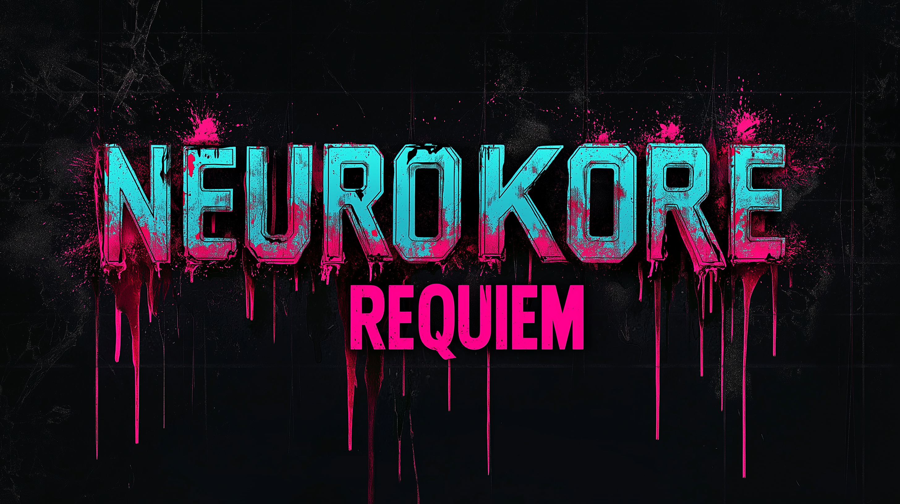

# Neurokore: Requiem

A Diablo 2-style ARPG set in a campy 80s sci-fi / Neuromancer cyberpunk hybrid world.

---

## Vision

Neurokore: Requiem is a hack-and-slash ARPG in the tradition of Diablo 2 — deep build crafting, loot-driven progression, and dense enemy encounters — set in a world where corporate dystopia, neural augmentation, and campy 80s horror collide.
