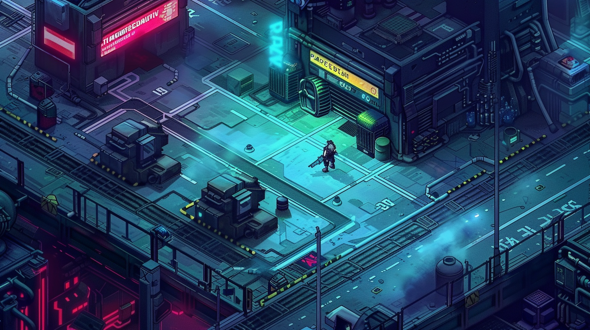

# Art Style

- **Style:** Isometric pixel art — modern fidelity, not chunky retro. Slightly more pixelated than the reference mockup above.
- **Palette:** Dark, desaturated base with neon pops. Teal/cyan dominant, hot pink and red as accent colors. Wet-street reflections on ground surfaces.
- **Lighting:** Real-time dynamic lighting — sprites receive light rather than baking it into textures. Neon signs, explosions, and spells cast actual light into the environment.
- **Animation:** ~25fps sprite animation in the Diablo 2 tradition. Weighted, deliberate feel.
- **Bosses:** Large-scale pixel art enemies — the small player character scale makes oversized bosses highly readable and impactful.

## Camera & Perspective

- **Projection:** Fixed isometric.
- **Occlusion:** Any geometry that would obscure the player character (walls, roofs, structures) becomes transparent. The player is always visible.
- **No rotation or zoom** (fixed camera).

## Class & Spec Color Language

Each class and spec has a consistent color identity used across sprites, UI, ability effects, and enemy design. Established through concept art — treat as a visual consistency guide.

| Class / Spec | Color Identity |
|---|---|
| Cyborg (base) | Teal/cyan + muted pink |
| Forged | Red/orange heat |
| Automaton | Teal/green data |
| Polymath | Magenta/violet |
| Human (base) | Warm white/amber |
| Survivalist | Dirty yellow, rust orange |
| Gentleman / Lady | Crisp white, cold blue |
| Enculted | Sickly green, deep purple |

This color language should carry through to ability particle effects, resource meter colors, portrait rim lighting, and spec-specific UI elements.
